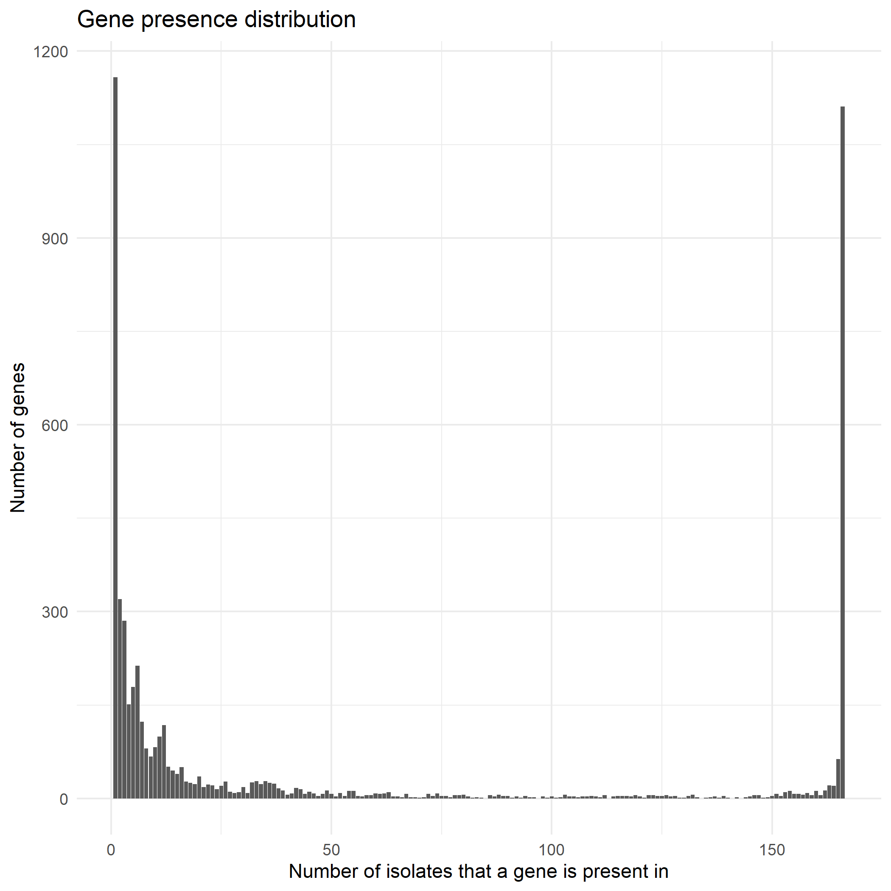

<!-- README.md is generated from README.Rmd. Please edit that file -->

# RoaRyVis

<!-- badges: start -->

<https://img.shields.io/badge/lifecycle-embryo-yellowgreen>
<!-- badges: end -->

RoaRyVis is an R package that processes output data from the pangenome
software, Roary (“Roary: Rapid large-scale prokaryote pan genome
analysis”, AJ Page et al., 2015.). In a pangenome study, the genomic DNA
a population of a certain species is sequenced, and the genes are
predicted in silico. Roary compares the predicted genes of each genome,
examines if certain genes are similar enough to be considered as the
same gene, and outputs a table containing the presence and absence of
each predicted gene in all genomes.

## Installation

Install the development version from [GitHub](https://github.com/) with:

``` r
install.packages("devtools")
devtools::install_github("davidtong28/RoaRyVis")
```

The github repository for RoaRyVis is
<https://github.com/davidtong28/RoaRyVis>.

## Example

So far there is only one visuallization function wrapped by RoaRyVis,
namely the distributionplot function, which returns a plot showing the
distribution of genes present in a given number of genomes in a
population.

``` r

RoaRyVis::distributionplot("testdata/campylobacter.csv","con","test_campy")
```



How I implemented the package components:

``` r
# Opened up github repository
# Opened new project and linked the project to this repository via "version control"-"git"
library (devtools)
create_package(~/RoaRyVis)
use_git()
use_r()
# Created `distributionplot.R` file. Added Roxigen 2 skeleton. Imported dplyr and ggplot2 (since I will use these packages extensively, they will go to NAMESPACE after document(), and no "::" colons will be needed to call functions from them)
# Created `input_csv.R` file as an internal function
# Created the "testdata" folder and "results" folder. Added two previous test data in /testdata folder
document()
use_pipe()
# Edited description file.
use_package(grDevices)
use_package(utils)
use_package(stringr)
use_package(here)
use_mit_license()
use_testthat()
use_test()
# Specified test "distributionplot test".
test() #No errors, all passed
library(here)
check(check_dir=here())# 0 Errors, 0 warnings
#When I run test(), it's returning 3 passed tests. But when I run check(), it returns with errors because the here::here directory changed. Since I use the relative path of the input file as the first argument of distributionplot, the input file I use for my test is not found since the here director changed. To change the check() path, I used the `check_dir=here::here()` argument

```
